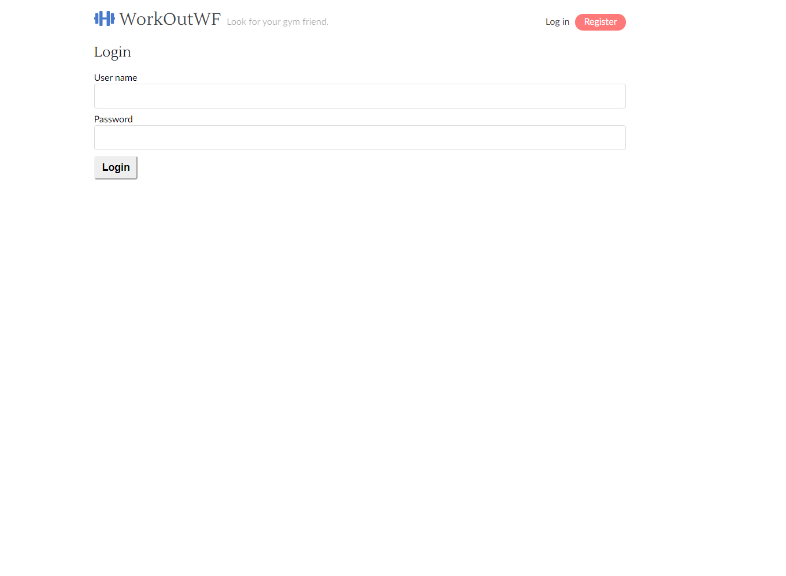
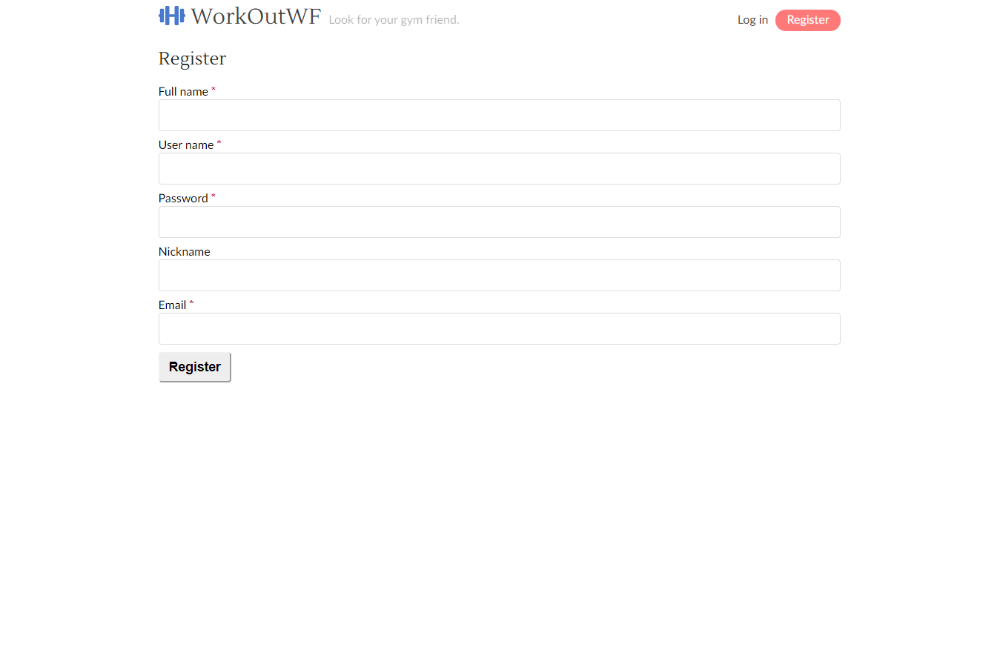
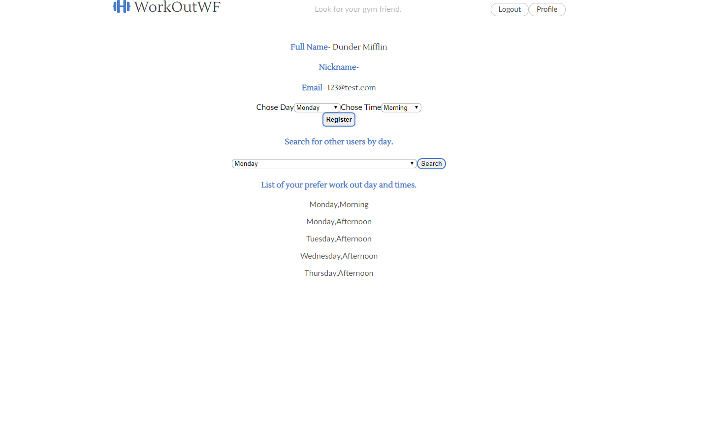

# WorkOutWF
Welcome to Work Out With Friends. This app will help you search for people that have a similar workout schedule. 

The code for the back end server can be found at 
[https://github.com/GLWolf/WorkOutWF-server].

The code for the client can be found at 
[https://github.com/GLWolf/WorkOutWF-client].

## Live Link
A live version of the app can be found at [https://workoutwf.now.sh/]
 
## Quick App Demo

## Technology

#### Front End

* React and OAuth
  * RESTful Api
  * Javascript (ES6)
  * React.js 
  * CSS3
  * HTML5
  * React-Vis (Uber)

  * Testing
  * Smoketest (integration)
  * Snapshot with Jest and Enzyme
* Http Request
  * Fetch

#### Back End

  * SQL
  * Node.js
  * Express.js
  * Mocha

#### Production

Deployed via Zeit

## Running Locally

To get the WorkOutWF client running successfully in development, you'll also need to have the WorkOutWF api running locally (links above).  

Please follow the API README on how to get the server up and running.

Then:

1) Start the api server with `npm run dev`
2) Clone this repo
3) Run `npm install`
4) Run `npm start`

